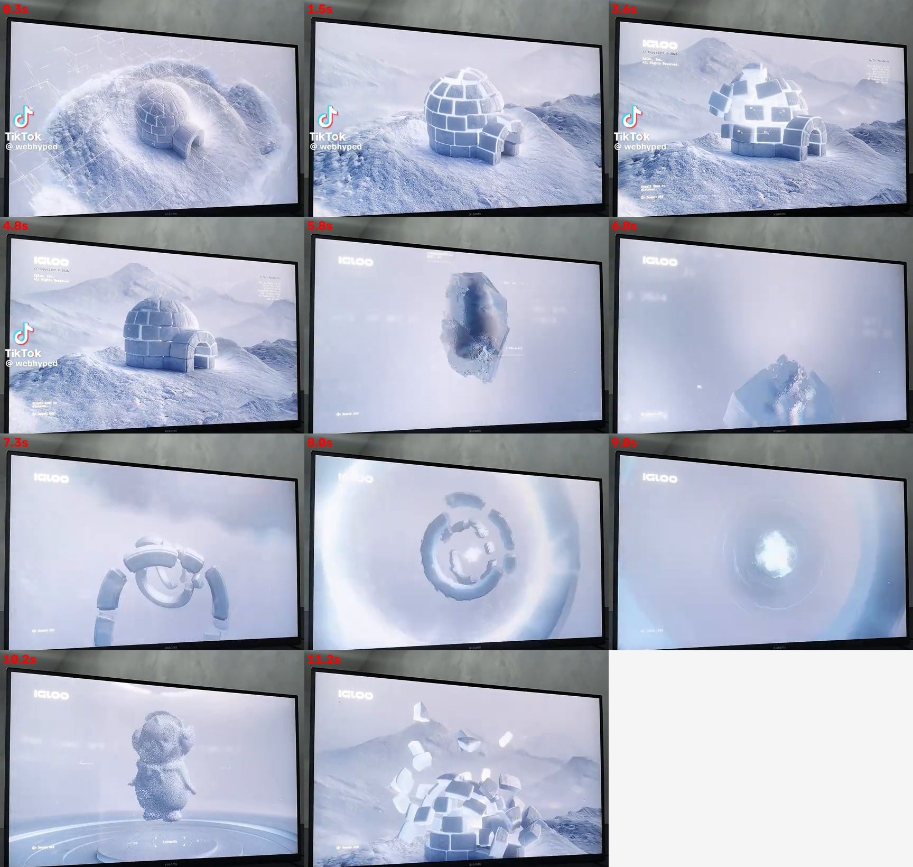

# Shop.Linus — Die Passage der Marken

Online-Shop für Kleidung verschiedener Marken. Die Startseite ist ein **Gang mit 10 Läden**: Man schaut gegen die Wand mit den Ladenfronten, jeder Scroll ist ein Schritt zur Seite. Ein Klick auf eine Tür öffnet sie, die Kamera fährt hinein, und man steht im Laden. Dort geht es über drei Etagen (Damen, Herren, Unisex) zu den Abteilungen. Zwischen den Etagen erscheint der Boden im Querschnitt.

Status: **Passage, Läden, Shop, Warenkorb und Kasse funktionieren (Testbetrieb).** Marken, Ladenbilder und Produkte sind Platzhalter. Die Näh-Animation kommt ganz am Ende.

Lokal ansehen: im Ordner `python3 -m http.server` starten und `http://localhost:8000` aufrufen.

## Die Passage

| Was | Wie |
|---|---|
| Gehen | Scrollen oder Wischen (auch auf dem Handy nach oben/unten), Pfeiltasten ← →, oder die Striche unten anklicken |
| Stehenbleiben | Die Ansicht rastet vor jedem Laden ein, das Schaufenster wird heller, „Eintreten“ erscheint |
| Eintreten | Klick auf den Laden: Türen gehen auf, Fahrt durch die Tür, Überblendung in die Ladenfarbe |
| Im Laden | Etagenknöpfe wie im Aufzug, Aufzugsanzeige rechts, Regale je Abteilung führen zu den gefilterten Artikeln |
| Zurück | „Zurück in die Passage“ oder die Zurück-Taste: Man steht wieder vor demselben Laden |
| Abkürzung | „Marken“ im Menü listet alle Läden, Damen/Herren/Unisex führen direkt zu den Artikeln |
| Bewegung reduziert | Wer das im System eingestellt hat, sieht die Läden als ruhiges Raster ohne Animation |

**Marken ändern:** `BRANDS` in `assets/data.js`. Pro Marke: Name, Farben (Wand, Zierleisten, Schild, Innenraum), Fassadenmaterial (`panel`, `stone`, `metal`, `brick`, `plaster`, `concrete`, `marble`), Fensterform (`rect`, `arch`), Schrift (`serif`, `sans`, `mono`), Markise.

**Produkte:** Solange es keine echten gibt, erzeugt `assets/data.js` pro Marke 13 Platzhalter (5 Damen, 5 Herren, 3 Unisex) aus `PRODUCT_TEMPLATES`. Echte Produkte bekommen die Felder `brand` (z. B. `"b03"`) und `gender` (`damen`, `herren`, `unisex`).

**Bibliotheken:** GSAP + ScrollTrigger (Gehen, Einrasten, Etagen), Lenis (weiches Scrollen), View Transitions (Seitenübergänge). Alles lokal in `assets/vendor/`. GSAP Flip liegt bereit für spätere Übergänge.

## Was schon funktioniert

| Bereich | Datei | Funktionen |
|---|---|---|
| Passage | `index.html` | Gang mit 10 Läden, danach Neuheiten, Versprechen, Newsletter |
| Laden | `laden.html?marke=…` | Foyer mit Schild, 3 Etagen mit Regalen, Boden-Querschnitt, Nachbarläden |
| Artikel | `shop.html` | Abteilungen (Damen, Herren, Unisex), Neuheiten, Filter (Kategorie, Marke, Farbe, Größe, Preis), Sortierung, Suche (`?q=`), Filter bleiben in der URL |
| Produktseite | `produkt.html?id=…` | 3 Bilder mit Zoom, Farbwahl, Größenwahl (ausverkaufte Größen gesperrt), Größentabelle, Merkliste, Details, ähnliche Artikel |
| Warenkorb | Schublade + `warenkorb.html` | Menge ändern, entfernen, auf die Merkliste verschieben, Rabattcode (`WILLKOMMEN10` = 10 %), Geschenkverpackung, Anzeige bis zum Gratisversand |
| Kasse | `kasse.html` | Kontakt, Adresse mit Prüfung (auch PLZ je Land), Standard/Express, Zahlungsart, AGB-Pflichthaken, Button „Zahlungspflichtig bestellen“, Bestellbestätigung mit Nummer |
| Merkliste | `merkliste.html` | Herz auf jeder Karte und Produktseite |
| Suche | Overlay im Header | Live-Ergebnisse über Name, Kategorie, Farbe, Material |
| Service | `service.html`, `kontakt.html` | Versand, Rückgabe, Zahlung, Größentabelle, FAQ, Kontaktformular mit Prüfung |
| Rechtliches | `impressum.html`, `datenschutz.html`, `agb.html`, `widerruf.html` | **Entwürfe mit gelb markierten Platzhaltern** |

Warenkorb und Merkliste bleiben im Browser gespeichert (Local Storage), auch über mehrere Tabs. Die Seite funktioniert auf dem Handy, und Schriften werden lokal geladen (keine Verbindung zu Google, wichtig für die DSGVO).

## Anpassen

- **Name der Passage:** in `assets/data.js` → `SHOP.brand` (Platzhalter „ATELIER“).
- **Produkte, Preise, Farben, Größen, ausverkaufte Größen:** alles in `assets/data.js`.
- **Versandkosten, Gratisversand-Grenze, Rabattcodes:** `SHOP` in `assets/data.js`.
- **Produktbilder:** sind vorerst gezeichnete SVG-Platzhalter (`assets/garments.js`). Sobald es Fotos gibt, werden sie ersetzt.

## Was vor dem echten Start noch fehlt

1. Echte Marken (nur als autorisierter Händler, Logos nur mit Erlaubnis), Ladenbilder, Produktfotos und Texte
2. Zahlung und Bestellungen wirklich abwickeln, z. B. mit Shopify (Storefront API), Stripe Checkout oder Snipcart. Aktuell ist das ein **Testbetrieb**: Es wird nichts abgebucht und nichts versendet.
3. Kontakt- und Newsletterformular an einen Dienst anbinden
4. Impressum, Datenschutz, AGB und Widerruf mit echten Angaben füllen und prüfen lassen
5. **Zum Schluss:** die Näh-Animation (siehe unten)

## Referenz: „IGLOO“-Website (TikTok von @webhyped)

Video vom 24.09.2026, ca. 12 Sekunden Bildschirmaufnahme. Standbilder: [`referenz/igloo-animation-standbilder.jpg`](referenz/igloo-animation-standbilder.jpg)

### Was passiert (Ablauf beim Scrollen)

| Zeit | Szene |
|---|---|
| 0,3 s | Drahtgitter/Punktlinien über einer Schneelandschaft, das Iglu entsteht aus dem Gitter |
| 1,5 s | Das Iglu ist fertig: realistische 3D-Szene, Kamera schräg von oben |
| 3,6 s | Beim Scrollen lösen sich einzelne Eisblöcke und schweben heraus, kleine Datenlabels hängen daran |
| 4,8 s | Die Blöcke setzen sich wieder zusammen |
| 5,8–6,8 s | Die Kamera fliegt hinein, Nebel und Weißblende, ein Eiskristall-Brocken rotiert |
| 7,3–9,0 s | Die Blöcke ordnen sich zu Ringen, ein Tunnel- oder Portal-Effekt mit Leuchten in der Mitte |
| 10,2 s | Eine Figur (Pinguin) aus tausenden Partikeln auf einer runden Plattform („Produkt-Bühne“) |
| 11,2 s | Die Blöcke fliegen zurück und bauen das Iglu wieder auf, der Kreis schließt sich |

### Design-Merkmale

- **Farben:** fast monochrom, eisiges Weiß, Hellgrau und kühles Blau. Keine bunten Akzente, das Objekt ist der Star.
- **Typografie/UI:** kleines Logo oben links („IGLOO“, breite Pixel- oder Tech-Schrift), winzige Monospace-Texte in den Ecken (Copyright, „Scroll down to discover“, „Sound: OFF“). Sehr zurückhaltend, wirkt wie ein technisches Interface.
- **Scroll-gesteuert:** Die Animation läuft nicht von selbst. Der Scrollbalken ist die Zeitleiste und treibt jeden Schritt an.
- **Ein Objekt, das sich zerlegt und neu zusammensetzt:** Teile lösen sich, schweben, ordnen sich neu und fügen sich wieder zusammen.
- **Weiche Übergänge:** Nebel, Weißblenden, Tiefenunschärfe, Kamera-Flüge statt harter Schnitte.
- **Partikel-Look:** Objekte bestehen teils aus Punktwolken oder Drahtgittern, bevor sie „fest“ werden.
- **Sound-Schalter:** optionaler Ton, standardmäßig aus.

## Übertragen auf Kleidung: „Nähvorgang“-Animation (später)

Idee für das ausgewählte Teil (z. B. Hoodie oder Jacke), gesteuert durch Scrollen:

1. **Schnittmuster:** Drahtgitter- oder Punktlinien zeichnen die Schnittteile flach auf den Hintergrund (wie das Gitter bei 0,3 s).
2. **Stoff:** Die Schnittteile bekommen Stofftextur und schweben einzeln im Raum (wie die losen Eisblöcke).
3. **Nähen:** Die Teile fliegen zueinander, eine Naht läuft als leuchtende Linie entlang der Kanten (Stich für Stich), Nadel oder Faden-Partikel optional.
4. **Details:** Kamera-Flug nah an Naht, Label, Reißverschluss, Nebel- oder Weißblende als Übergang.
5. **Fertig:** Das fertige Teil dreht sich auf einer runden Plattform (wie der Pinguin), daneben Name, Preis und „In den Warenkorb“.
6. **Optional:** Beim Weiterscrollen zerlegt es sich wieder in Schnittteile (Kreis schließt sich).

Stil übernehmen: ruhige Farbwelt passend zur Marke, kleine Monospace-UI in den Ecken, viel Leerraum, das Kleidungsstück im Mittelpunkt.

### Technik (Vorschlag für später)

- **Three.js** (WebGL) für die 3D-Szene, **GSAP ScrollTrigger** für die Kopplung an den Scrollbalken.
- 3D-Modell des Kleidungsstücks mit getrennten Schnittteilen, z. B. aus **CLO3D** oder **Marvelous Designer** (dort entstehen Schnittteile und Nähte sowieso), exportiert als glTF.
- Alternativ, einfacher: vorgerenderte Bildsequenz (z. B. aus Blender), die per Scroll durchgeblättert wird. Sieht fast gleich aus und läuft auf Handys stabiler.
- Rückfall ohne Animation für langsame Geräte und für „Bewegung reduzieren“ (`prefers-reduced-motion`).
